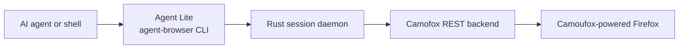

# Agent Lite

A compact agent-browser fork built around Camofox and Camoufox-powered Firefox.

[](https://skills.sh/vercel-labs/agent-browser)

> [!IMPORTANT]
> Agent Lite is an experimental fork of [vercel-labs/agent-browser](https://github.com/vercel-labs/agent-browser). The repository is `thoriqakbar0/agent-lite`, but the executable remains `agent-browser` so existing agent prompts and scripts keep their familiar command surface.

Agent Lite makes [Camofox](https://github.com/thoriqakbar0/camofox-browser) the browser backend. A plain `agent-browser open` starts a local Camofox server, creates an isolated Camoufox-powered Firefox tab, and routes browser commands through it.

“Lite” describes the smaller decision surface: install the paired renderer and start browsing.

## Quick start

Build Agent Lite from source and install the paired Camofox launcher:

```bash
git clone https://github.com/thoriqakbar0/agent-lite
cd agent-lite
pnpm install
pnpm build:native
pnpm link --global

pnpm add --global @askjo/camofox-browser

agent-browser open https://example.com
agent-browser snapshot
agent-browser screenshot page.png
agent-browser close
```

The fork is not published under the upstream `agent-browser` package name. `close` deletes the Camofox user session and stops the server when Agent Lite launched it.

## Core workflow

Agent Lite keeps the compact snapshot and element-reference workflow:

```bash
agent-browser open https://example.com
agent-browser snapshot
agent-browser click @e3
agent-browser fill @e5 "hello"
agent-browser screenshot result.png
agent-browser close
```

Snapshot references are fresh page state. Take another snapshot after navigation or a dynamic page update before reusing an element reference.

## Supported Camofox capabilities

| Capability | Status |
| --- | --- |
| Open and navigate | Supported |
| Current URL and title | Supported |
| Rendered page HTML | Supported |
| JavaScript evaluation | Supported |
| Accessibility snapshots | Supported |
| Stable `@eN` snapshot references | Supported |
| Click, fill, type, key press, and page scroll | Supported |
| PNG screenshots | Supported |
| Back, forward, and reload | Supported |
| Session cleanup and owned-server shutdown | Supported |

Snapshot selector, depth, and URL filtering are not supported yet. Other unavailable operations fail explicitly instead of changing browser behavior behind the caller’s back.

## Architecture



Each Agent Lite session owns one Camofox user identity and tab. When Agent Lite launches the server, it also owns server cleanup.

## Camofox discovery

Agent Lite resolves Camofox in this order:

1. Attach to `AGENT_BROWSER_CAMOFOX_URL` when it is set.
2. Launch `AGENT_BROWSER_CAMOFOX_EXECUTABLE` when it is set.
3. Launch a `camofox-browser` executable beside the `agent-browser` binary.
4. Launch `camofox-browser` from `PATH`.

Set `AGENT_BROWSER_CAMOFOX_ACCESS_KEY` when the server requires an access key. Servers launched by Agent Lite bind to `127.0.0.1` on an available port.

## Sessions

Use a named session to isolate tabs and browser state:

```bash
agent-browser --session research open https://example.com
agent-browser --session research snapshot
agent-browser --session research close
```

Run `agent-browser session list` to inspect active sessions and `agent-browser close --all` to close every Agent Lite session.

## Develop Agent Lite and Camofox together

Keep the repositories beside each other and point Agent Lite at the local Camofox launcher:

```bash
git clone https://github.com/thoriqakbar0/agent-lite
git clone https://github.com/thoriqakbar0/camofox-browser

cd camofox-browser
pnpm install

cd ../agent-lite
pnpm install
pnpm build:native

export AGENT_BROWSER_CAMOFOX_EXECUTABLE="$PWD/../camofox-browser/bin/camofox-browser.js"
./cli/target/release/agent-browser open https://example.com
```

The launcher can instead sit beside the built `agent-browser` binary.

## Requirements

- Node.js 24 or newer
- pnpm 11 or newer
- Rust
- `@askjo/camofox-browser`

## Testing

Run the Rust unit tests:

```bash
cd cli
cargo test
```

Check formatting and linting:

```bash
cd cli
cargo fmt -- --check
cargo clippy
```

The end-to-end suite exercises the full native daemon pipeline:

```bash
cd cli
cargo test e2e -- --ignored --test-threads=1
```

## Updating

This fork is source-installed. Update the checkout and rebuild:

```bash
git pull --ff-only
pnpm install
pnpm build:native
pnpm link --global
```

Do not use `agent-browser upgrade` for this fork because that command follows the upstream package distribution path.

## Status

Agent Lite is experimental. The paired local build has been exercised on macOS ARM64 for navigation, URL and title reads, accessibility snapshots, element references, JavaScript evaluation, screenshots, and cleanup through Camofox.

## License

Apache-2.0
